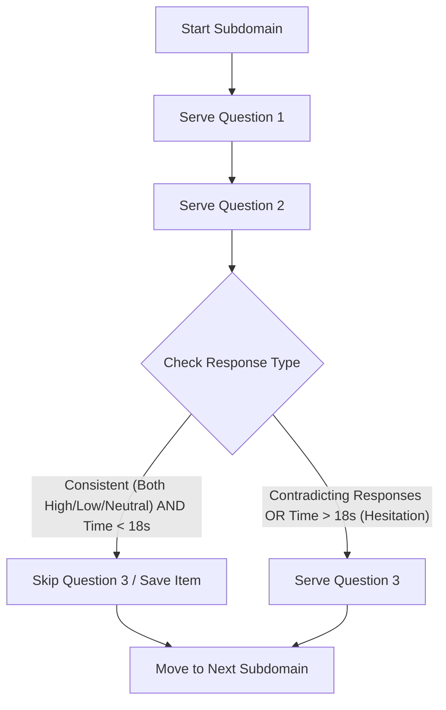

# NeuroPi Student Development Intelligence Assessment System
### Grades 8–12 Academic & Career Guidance Portal

An advanced, offline-first psychometric assessment portal implementing custom **Computer Adaptive Testing (CAT)**, deterministic profile matching, rule-based stream recommendations, and live LLM integration with Google AI Studio's Gemini API.

---

## 1. Project Overview & Quick Start

The system runs entirely inside the web browser. It has been built with vanilla HTML, modern CSS, and JavaScript. Because all database records (525 master items, scoring bands, and 1,080 profile permutations) have been packed into global JavaScript files (`questions.js`, `rules.js`), the application has **zero offline dependencies** and is unaffected by browser CORS blockages when loaded directly from the filesystem.

### How to Run the Portal
* **Option A: Direct Launch (Default)**
  Double-click `index.html` on your computer, or run the following command in PowerShell:
  ```powershell
  Start-Process "index.html"
  ```
* **Option B: Run a Local Server**
  If you want to serve it locally on your machine, run Python's built-in lightweight HTTP server:
  ```powershell
  python -m http.server 8000
  ```
  Then navigate to: [http://localhost:8000](http://localhost:8000)

* **Testing Shortcut (Demo Report):**
  Click the **Demo Report** button on the registration screen. This instantly mock-populates responses for all 28 subdomains based on a realistic engineering/science profile, completing the assessment instantly so you can inspect the dashboard.

---

## 2. File Architecture

* `index.html` — Glassmorphic desktop portal structure containing registration, test-taking UI, interactive Counselor console, and printable report tabs.
* `styles.css` — High-fidelity theme styling featuring glowing neon accents, responsiveness, and media print layout overrides (`@media print`).
* `app.js` — Core state manager, CAT branching engine, score aggregator, stream recommendations, and Gemini API integration.
* `questions.js` — Global questions bank database (`window.NEUROPI_QUESTIONS`) containing 525 psychometric items.
* `rules.js` — Global configurations database (`window.NEUROPI_RULES`) containing scoring map thresholds, timing bands, and 1,080 permutation rules.

---

## 3. Dynamic Computer Adaptive Testing (CAT) Engine

Rather than requiring the student to go through all 525 questions or a long fixed diagnostic, the portal runs a custom **AI Adaptive Engine** to shorten the test length by 15–20% (saving 12–15 items) without compromising psychometric validity.



### A. Behavioral/Likert Layer Early Bypassing
1. Question 1 is served.
2. Question 2 is served.
3. The responses are checked for **Consistency**:
   * If both responses are *High* ($\ge 4$), *Low* ($\le 2$), or *Neutral* ($= 3$), and **no response took > 18 seconds**:
     * The 3rd question is skipped (saving student fatigue).
     * The score is calculated as the average of the first two questions.
   * If the responses contradict each other, or if any question took **> 18 seconds (Hesitation Flag)**, the 3rd question is forced to ensure stability.

### B. Cognitive Layer Difficulty Routing (MCQ)
Cognitive questions (Numerical, Logic, Verbal, Abstract, Spatial) are partitioned by difficulty:
* **Easy:** Indices 0–6 (7 questions)
* **Medium:** Indices 7–13 (7 questions)
* **Hard:** Indices 14–19 (6 questions)

The engine branches dynamically:
* The assessment starts with a **Medium** difficulty question.
* A correct response steps up difficulty (Medium $\rightarrow$ Hard or Easy $\rightarrow$ Medium).
* An incorrect response steps down difficulty (Medium $\rightarrow$ Easy or Hard $\rightarrow$ Medium).
* Three questions are served per cognitive subdomain to measure speed and accuracy.

### C. Attention Check Interspersions
Three validation check items are automatically injected after 18, 36, and 54 answered questions:
* **AQ082** ("I answered honestly") $\rightarrow$ Fails if response $< 4$.
* **AQ083** ("I read carefully") $\rightarrow$ Fails if response $< 4$.
* **AQ084** ("I selected randomly") $\rightarrow$ Fails if response $> 2$.
* If a student fails **2 or more** validation checks, a warning is flagged on the dashboard.

---

## 4. Scoring Formulas & Analytics

### Subdomain Score Normalization
* **Likert subdomains:**
  $$\text{Score} = \frac{\text{Adjusted Value} - 1}{4} \times 100$$
  *(Where $\text{Adjusted Value} = 6 - \text{Response}$ if the item is Reverse Scored; otherwise $\text{Adjusted Value} = \text{Response}$)*
* **Cognitive MCQ subdomains:**
  $$\text{Score} = \begin{cases} 100, & \text{if Response} = \text{Correct Key} \\ 0, & \text{otherwise} \end{cases}$$

### Key Index Aggregations
* **RIASEC Clarity** = $\max(\text{Realistic, Investigative, Artistic, Social, Enterprising, Conventional})$
* **Big Five Balance** = $\text{Average}(\text{Openness, Conscientiousness, Extraversion, Agreeableness, } 100-\text{Neuroticism})$
* **Cognitive Index** = $\text{Average}(\text{Numerical, Logic, Verbal, Abstract, Spatial})$
* **Emotional Sustainability** = $\text{Average}(\text{Confidence, Resilience, Coping, } 100-\text{Stress})$
* **Learning Fit** = $\max(\text{Visual, Auditory, Kinesthetic, ReadingWriting})$
* **Career Readiness** = $\text{Average}(\text{RIASEC Clarity, Emotional Sustainability, CareerClarity})$

---

## 5. Academic Stream & Career Recommendations

At the end of the assessment, the system dynamically calculates the recommended academic stream for the student based on their interests and cognitive profiles:

### Weighted Stream Affinity Calculation
* **Science Stream PCM/PCB:**
  $$\text{Weight} = (\text{Realistic} \times 0.25) + (\text{Investigative} \times 0.35) + (\text{Logic} \times 0.20) + (\text{Numerical} \times 0.20)$$
* **Commerce Stream:**
  $$\text{Weight} = (\text{Conventional} \times 0.35) + (\text{Enterprising} \times 0.35) + (\text{Numerical} \times 0.30)$$
* **Humanities & Arts Stream:**
  $$\text{Weight} = (\text{Artistic} \times 0.35) + (\text{Social} \times 0.35) + (\text{Verbal} \times 0.30)$$

### Decision Matrix & Action Plan
1. **Science (PCB - Medical & Life Sciences):**
   * *Condition:* Science Weight is highest AND Investigative Score $>$ Realistic Score.
   * *Core Subjects:* Physics, Chemistry, Biology, Biotechnology.
   * *Action Plan:* Focus on experimental biology and concept-mapping; build exam stamina for medical entrances.
2. **Science (PCM - Engineering & Tech):**
   * *Condition:* Science Weight is highest AND Realistic Score $\ge$ Investigative Score.
   * *Core Subjects:* Physics, Chemistry, Mathematics, Computer Science.
   * *Action Plan:* Practice math derivations daily; participate in coding or robotics projects.
3. **Commerce (with Math / Applied Math):**
   * *Condition:* Commerce Weight is highest.
   * *Core Subjects:* Accountancy, Business Studies, Economics, Mathematics.
   * *Action Plan:* Read business journals; study basic finance; participate in mock business pitches.
4. **Humanities & Liberal Arts:**
   * *Condition:* Humanities Weight is highest.
   * *Core Subjects:* History, Political Science, Psychology, Sociology, Literature.
   * *Action Plan:* Strengthen analytical writing; participate in debating clubs; explore Law/Design paths.

---

## 6. Gemini AI Studio Integration

If the user enters a Google AI Studio API key (a default fallback key `AQ.Ab8RN6IcPtEVDv_o9u3KiQlPt5YQ9aE-8Ric9S7j7RnHEJufLA` is pre-configured), the **Generate Advanced AI Synthesis** button becomes active.

1. **API Endpoint:**
   `https://generativelanguage.googleapis.com/v1beta/models/gemini-1.5-flash:generateContent?key=${apiKey}`
2. **Payload:** Sends a structured JSON prompt containing:
   * Student demographics (Name, Grade).
   * Matched profile permutation code.
   * Dominant indices (RIASEC group, Big Five, Learning style, Cog band).
   * Recommended Stream selection and action plans.
   * Target local interpretations extracted from the 1,080 offline rules database.
3. **Output Parsing:** The app splits the response into four markdown-cleaned paragraphs, rendering them directly under the printable report sections.
