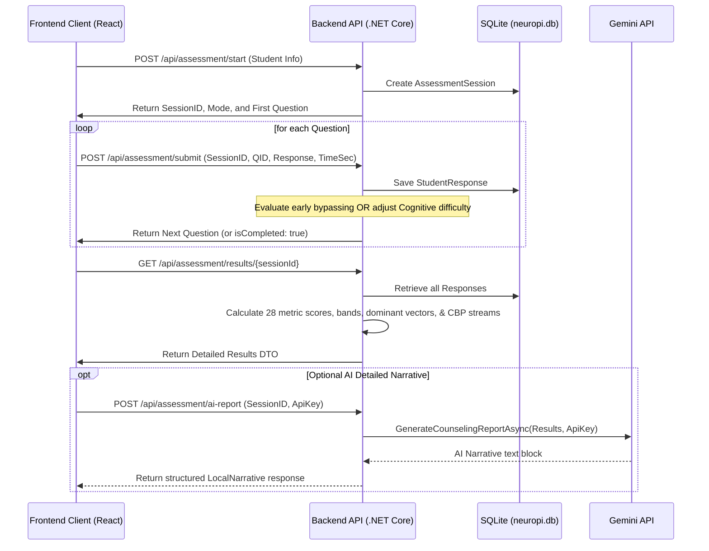

# How the NeuroPi Exam / Assessment Works

This document details the mechanics of how the psychometric assessment works in the **NeuroPi System**, explaining both the **Frontend React Portal** and the **Backend .NET Core API (`NeuroPi.Api`)**.

---

## 1. Core Workflow Architecture

The assessment follows a stateful client-server exchange:

---

## 2. Assessment Modes

When starting a session, the student can select one of two testing modes:

### A. Compact Mode
* **Fixed progression:** Delivers a static, pre-defined battery of exactly **84 questions** specified in the frontend template (pulled from `rules.json`'s `StudentResponseTemplate`).
* **Session Tracking:** Progresses strictly sequentially using a `CompactIndex` counter.

### B. Adaptive Mode
* **Dynamic progression:** Traverses **27 distinct subdomains** in sequence (e.g., RIASEC Interests, Big Five personality traits, Cognitive Abilities, Emotional Profiling, Learning Styles, and additional indicators).
* **Interspersed Attention/Validity Checks:** To detect rushing, distraction, or random guessing, the engine automatically injects attention validation checks (from the `"Validity & Readiness"` domain) at three points during the test:
  * When total answered questions $\ge 18$
  * When total answered questions $\ge 36$
  * When total answered questions $\ge 54$

---

## 3. Dynamic Adaptive Mechanics

In Adaptive Mode, the backend uses advanced logic to reduce the testing time and adjust question difficulty dynamically:

### A. Cognitive Difficulty Scaling (Item Response Adaptation)
For questions under the **"Cognitive Ability"** domain (Numerical, Logic, Verbal, Abstract, Spatial subdomains):
* **Difficulty Levels:** Questions are partitioned into three pools based on index ranges:
  * **Easy** (First 7 questions of the subdomain)
  * **Medium** (Next 7 questions)
  * **Hard** (Remaining 6 questions)
* **Adaptive Escalation/De-escalation:**
  * If the student answers a cognitive question **correctly**, the difficulty level scales up: `Easy` $\rightarrow$ `Medium` $\rightarrow$ `Hard`.
  * If the student answers **incorrectly**, the difficulty level scales down: `Hard` $\rightarrow$ `Medium` $\rightarrow$ `Easy`.
* **Subdomain Question Limit:** Exactly **3 questions** are asked per cognitive subdomain before moving to the next.

### B. Early Bypassing (Question Reduction)
For non-cognitive Likert-scale subdomains (RIASEC interest, Big Five personality, Learning styles, etc.), the engine assesses response consistency and speed to determine if it can skip asking further questions in a subdomain:
* **Max Questions:** A maximum of 3 questions are available per subdomain.
* **Early Terminating Condition:** After answering the **2nd question** in a subdomain, the engine checks:
  1. **Hesitation Check:** Has the student spent more than 18 seconds on any question in this subdomain?
  2. **Consistency Check:** Did the student provide consistent responses? Specifically, if the calculated score of the first two questions are:
     * Both **High** ($\ge 75\%$)
     * Both **Low** ($\le 25\%$)
     * Both **Neutral** ($= 50\%$)
* **Bypass Execution:** If there is **no hesitation** and the responses are **highly consistent**, the engine skips the 3rd question for that subdomain and advances to the next metric, saving student testing time.

---

## 4. Scoring, Diagnostics, and Recommendations

Upon completion of the assessment, the results are compiled:

### A. Subdomain Scoring
* **Likert Scale Questions:** Scores are calculated out of 100:
  $$\text{Score} = \frac{\text{ResponseValue} - 1}{4} \times 100$$
  *(If the question is reverse-scored, the response value is inverted as $6 - \text{ResponseValue}$ before calculating).*
* **MCQ Questions:** Graded binarily: $100\%$ for correct keys, $0\%$ for incorrect keys.
* **Bands:** Divided into `Low` ($<40$), `Moderate` ($40 - 69$), and `High` ($\ge 70$).

### B. Vectors and Permutation Matching
* **Dominant Vectors:** The engine extracts the highest scoring category for **RIASEC Interest** (Realistic, Investigative, Artistic, Social, Enterprising, Conventional), **Big Five Personality** (Openness, Conscientiousness, Extraversion, Agreeableness, Neuroticism), and **Learning Style** (Visual, Auditory, Kinesthetic, Reading/Writing).
* **1080 Permutations Mapping:** The combination of:
  $$\text{[Dominant RIASEC]} + \text{[Dominant Big Five]} + \text{[Cognitive Band]} + \text{[Emotional Band]} + \text{[Dominant Learning Style]}$$
  is mapped against a database of **1080 permutations** in `rules.json` to fetch a customized profile code (e.g., `NP-P1028`), executive summaries, and counselor roadmap actions.

### C. Academic Stream Recommendations
Calculates weighted affinity scores to recommend CBSE high-school academic streams:
* **Science (Engineering - PCM):** Weighted heavily on Realistic, Investigative interests, Logical, and Numerical reasoning.
* **Science (Medical - PCB):** Weighted on Investigative interest (where Investigative > Realistic), Logical, and Numerical reasoning.
* **Commerce (with/without Math):** Weighted on Conventional interest, Enterprising interest, and Numerical reasoning.
* **Humanities & Liberal Arts:** Weighted on Artistic, Social interests, and Verbal reasoning.

### D. Validity Alerts
Triggers warning flags for counselor review:
* **Attention consistency review:** Failed $\ge 2$ interspersed attention validation checks (indicates potential fatigue or random clicking).
* **High stress sensitivity:** Stress subdomain score exceeds $70\%$.
* **Low study consistency:** Study habits index drops below $40\%$.
* **Career confusion:** Career clarity index drops below $40\%$.
